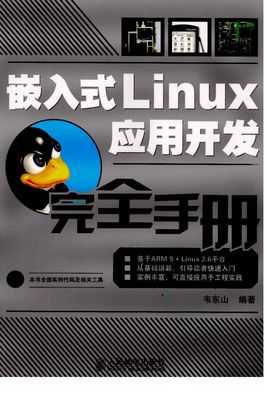
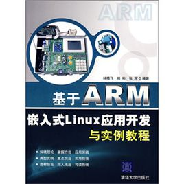
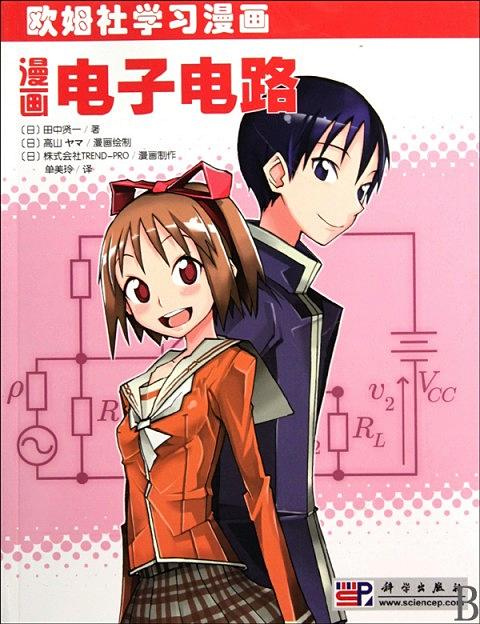

# jz2440学习笔记

## 本仓库内容

1. jz2440学习笔记
2. 思维导图
3. ARM体系架构学习
4. Linux内核驱动学习

```
Something I hope you know before go into the coding~
First, please watch or star this repo, I'll be more happy if you follow me.
Bug report, questions and discussion are welcome, you can post an issue or pull a request.
```

## 相关站点

* GitHub地址:<https://github.com/yifengyou/jz2440>
* GitBook地址:<https://yifengyou.gitbooks.io/jz2440/content/>

## 目录

* [基础入门](docs/基础入门/基础入门.md)
    * [怎么看原理图之GPIO和门电路](docs/基础入门/怎么看原理图之GPIO和门电路.md)
    * [怎么看原理图之协议类接口之UART](docs/基础入门/怎么看原理图之协议类接口之UART.md)
    * [怎么看原理图之协议类接口之I2C](docs/基础入门/怎么看原理图之协议类接口之I2C.md)
    * [怎么看原理图之协议类接口之SPI](docs/基础入门/怎么看原理图之协议类接口之SPI.md)
    * [怎么看原理图之协议类接口之NANDFlash](docs/基础入门/怎么看原理图之协议类接口之NANDFlash.md)
    * [怎么看原理图之协议类接口之LCD](docs/基础入门/怎么看原理图之协议类接口之LCD.md)
    * [怎么看原理图之内存类接口](docs/基础入门/怎么看原理图之内存类接口.md)
    * [怎么看原理图之分析S3C2410开发板](docs/基础入门/怎么看原理图之分析S3C2410开发板.md)
    * [怎么看原理图之分析S3C2440开发板](docs/基础入门/怎么看原理图之分析S3C2440开发板.md)
    * [怎么看原理图之分析S3C6410开发板](docs/基础入门/怎么看原理图之分析S3C6410开发板.md)
    * [刚接触开发板之接口接线工具](docs/基础入门/刚接触开发板之接口接线工具.md)
    * [刚接触开发板之烧写裸板程序](docs/基础入门/刚接触开发板之烧写裸板程序.md)
    * [刚接触开发板之重烧整个系统](docs/基础入门/刚接触开发板之重烧整个系统.md)
    * [刚接触开发板之使用vmwae和预先做好的ubuntu](docs/基础入门/刚接触开发板之使用vmwae和预先做好的ubuntu.md)
    * [刚接触开发板之u-boot打补丁编译使用及建sourceinsight工程](docs/基础入门/刚接触开发板之u-boot打补丁编译使用及建sourceinsight工程.md)
    * [刚接触开发板之内核打补丁编译使用及建sourceinsight工程](docs/基础入门/刚接触开发板之内核打补丁编译使用及建sourceinsight工程.md)
    * [刚接触开发板之制作根文件系统及初试驱动](docs/基础入门/刚接触开发板之制作根文件系统及初试驱动.md)
    * [在TQ2440,MINI2440上搭建视频所用系统](docs/基础入门/在TQ2440,MINI2440上搭建视频所用系统.md)
    * [win7下不能使用dnw烧写的替代方法](docs/基础入门/win7下不能使用dnw烧写的替代方法.md)
    * [环境搭建及工具+概念介绍](docs/基础入门/环境搭建及工具+概念介绍.md)
* [ARM体系结构](docs/ARM体系结构/ARM体系结构.md)
    * [GPIO实验](docs/ARM体系结构/GPIO实验.md)
    * [存储管理器实验](docs/ARM体系结构/存储管理器实验.md)
    * [MMU实验](docs/ARM体系结构/MMU实验.md)
    * [NANDFLASH控制器](docs/ARM体系结构/NANDFLASH控制器.md)
    * [中断控制器](docs/ARM体系结构/中断控制器.md)
    * [系统时钟和UART实验](docs/ARM体系结构/系统时钟和UART实验.md)
    * [LCD实验](docs/ARM体系结构/LCD实验.md)
    * [u-boot分析之编译体验](docs/ARM体系结构/u-boot分析之编译体验.md)
    * [u-boot分析之Makefile结构分析](docs/ARM体系结构/u-boot分析之Makefile结构分析.md)
    * [u-boot分析之源码第1阶段](docs/ARM体系结构/u-boot分析之源码第1阶段.md)
    * [u-boot分析之源码第2阶段](docs/ARM体系结构/u-boot分析之源码第2阶段.md)
    * [u-boot分析之u-boot命令实现](docs/ARM体系结构/u-boot分析之u-boot命令实现.md)
    * [u-boot分析_uboot启动内核](docs/ARM体系结构/u-boot分析_uboot启动内核.md)
    * [内核启动流程分析之编译体验](docs/ARM体系结构/内核启动流程分析之编译体验.md)
    * [内核启动流程分析之配置](docs/ARM体系结构/内核启动流程分析之配置.md)
    * [内核启动流程分析之Makefile](docs/ARM体系结构/内核启动流程分析之Makefile.md)
    * [内核启动流程分析之内核启动](docs/ARM体系结构/内核启动流程分析之内核启动.md)
    * [构建根文件系统之启动第1个程序](docs/ARM体系结构/构建根文件系统之启动第1个程序.md)
    * [构建根文件系统之init进程分析](docs/ARM体系结构/构建根文件系统之init进程分析.md)
    * [构建根文件系统之busybox](docs/ARM体系结构/构建根文件系统之busybox.md)
    * [构建根文件系统之构建根文件系统](docs/ARM体系结构/构建根文件系统之构建根文件系统.md)
* [Linux驱动](docs/Linux驱动/Linux驱动.md)
    * [字符设备驱动程序之概念介绍](docs/Linux驱动/字符设备驱动程序之概念介绍.md)
    * [字符设备驱动程序之LED驱动程序编写编译](docs/Linux驱动/字符设备驱动程序之LED驱动程序_编写编译.md)
    * [字符设备驱动程序之LED驱动程序测试改进](docs/Linux驱动/字符设备驱动程序之LED驱动程序_测试改进.md)
    * [字符设备驱动程序之LED驱动程序操作LED](docs/Linux驱动/字符设备驱动程序之LED驱动程序_操作LED.md)
    * [字符设备驱动程序之查询方式的按键驱动程序](docs/Linux驱动/字符设备驱动程序之查询方式的按键驱动程序.md)
    * [字符设备驱动程序之中断方式的按键驱动_Linux异常处理结构](docs/Linux驱动/字符设备驱动程序之中断方式的按键驱动_Linux异常处理结构.md)
    * [字符设备驱动程序之中断方式的按键驱动_Linux中断处理结构](docs/Linux驱动/字符设备驱动程序之中断方式的按键驱动_Linux中断处理结构.md)
    * [字符设备驱动程序之中断方式的按键驱动编写代码](docs/Linux驱动/字符设备驱动程序之中断方式的按键驱动_编写代码.md)
    * [字符设备驱动程序之poll机制](docs/Linux驱动/字符设备驱动程序之poll机制.md)
    * [字符设备驱动程序之异步通知](docs/Linux驱动/字符设备驱动程序之异步通知.md)
    * [字符设备驱动程序之同步互斥阻塞](docs/Linux驱动/字符设备驱动程序之同步互斥阻塞.md)
    * [字符设备驱动程序之定时器防抖动](docs/Linux驱动/字符设备驱动程序之定时器防抖动.md)
    * [输入子系统概念介绍](docs/Linux驱动/输入子系统概念介绍.md)
    * [输入子系统第编写驱动程序](docs/Linux驱动/输入子系统第编写驱动程序.md)
    * [驱动程序分层分离概念_总线驱动设备模型](docs/Linux驱动/驱动程序分层分离概念_总线驱动设备模型.md)
    * [LCD驱动程序之层次分析](docs/Linux驱动/LCD驱动程序之层次分析.md)
    * [LCD驱动程序之硬件操作](docs/Linux驱动/LCD驱动程序之硬件操作.md)
    * [LCD驱动程序之编写代码之1初步编写](docs/Linux驱动/LCD驱动程序之编写代码之1初步编写.md)
    * [LCD驱动程序之编写代码之2硬件设置](docs/Linux驱动/LCD驱动程序之编写代码之2硬件设置.md)
    * [LCD驱动程序之编写代码之3显存和调色板设置](docs/Linux驱动/LCD驱动程序之编写代码之3显存和调色板设置.md)


## 思维导图


## 参考教程


**韦东山**毕业于中国科学技术大学, 物理软件双学位,畅销书作者《嵌入式Linux应用开发完全手册》作者，10多年嵌入式LINUX行业经验。嵌入式linux培训领域的佼佼者。

* 百叶网官方站点:<http://www.100ask.net/index.html>
* 淘宝站点:<https://100ask.taobao.com/>

课程从头到尾，每个视频都是现场从0逐行编写/调试工作中的绝大部分驱动，内容—20%理论 +80%实操。

● 完全抛弃其他视频“只讲解Linux内核现成驱动的框架，然后下载测试”，完全从0逐行编写，在写驱动之前明确先后步骤，逐个讲解各个知识点，依次完成各个子驱动，循循渐进

● 课程**句句都是干货**，没有一句“正确的废话”，学习后保证可以跟着视频完成相应的实验。

● 课程内容涵盖: Linux内核常用机制(总线-设备-驱动，输入子系统, 中断，休眠唤醒，异步通知，阻塞和非阻塞I/O等)，常用部件驱动(LED、按键、触摸屏、LCD、USB、Nand Flash、Nor Flash、网卡、I2C[总线驱动和设备驱动]和声卡等)。

● 独家调试秘笈倾情奉献：裸机调试、驱动调试和应用调试。


```
本仓库仅个人学习笔记，内容基本为视频教程所讲。经咨询客服可以截图做笔记网上发表，如有涉及侵权问题请早告知。
```

## 参考书籍



** 《嵌入式Linux应用开发完全手册》 **是2008年人民邮电出版社出版的图书，作者是韦东山。

主要讲述了从最简单的点亮一个LED开始，由浅入深地讲解，使读者最终可以配置、移植、裁剪内核，编写驱动程序，移植GUI系统，掌握整个嵌入式Linux系统的开发方法。



** 《基于ARM嵌入式Linux应用开发与实例教程》 **是2007年清华大学出版社出版的图书，作者是林晓飞，刘彬，张辉。

从理论基础及实际应用的角度出发，不仅详细地讲述了嵌入式系统基础理论方面的知识，还结合具体的实验开发板讲述了嵌入式系统的详细开发方法和步骤。实际案例丰富，内容的可读性，可用性和实践性强。

讲述的理论基础知识包括嵌入式系统的硬件、软件方面的知识和相关的系统开发方法。硬件方面重点介绍了ARM微处理器的知识，软件方面主要介绍了Linux操作系统方面的知识。实验开发案例的开发环境基于ARM9微处理器和Linux操作系统。

不仅有详细的理论基础知识介绍，还有大量的开发案例以供参考，可读性和实用性强，可供从事嵌入式系统设计和开发的广大科技人员阅读，也可作为大专院校电子控制专业及其他相关专业的教材或参考资料。



** 《漫画电子电路》 **是2010年科学出版社出版的图书，作者是（日）田中贤一等。 该书是以漫画的形式讲解电子电路基础的入门图书，用漫画和插图一步一步地对电子电路进行说明。

## 总结

```
* 理论联系实际，知道怎么操作，代码要会写，源码要看的懂~
```
