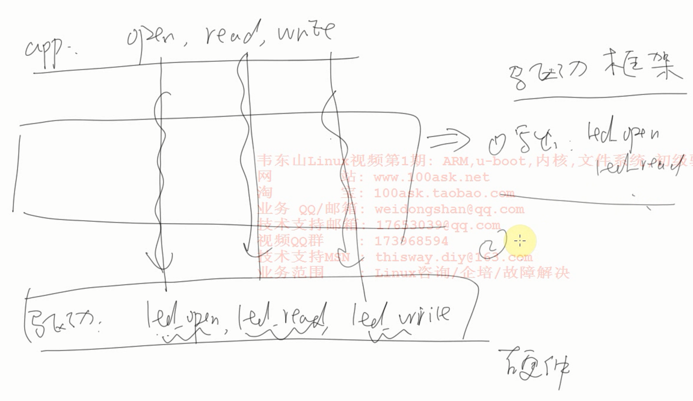
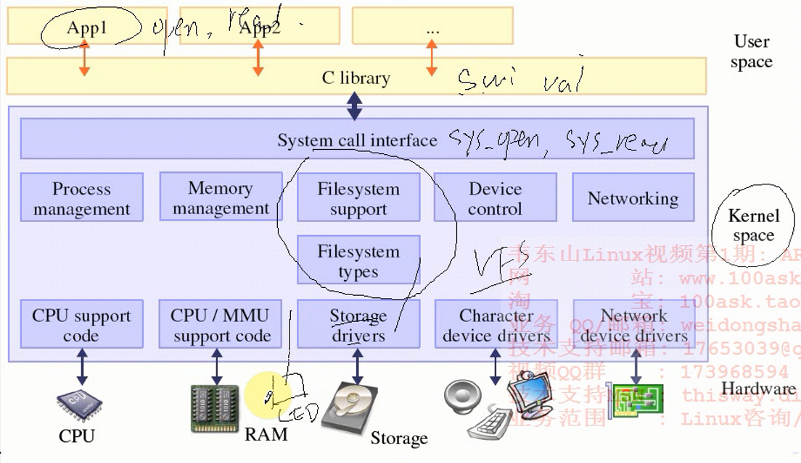

<!-- TOC depthFrom:1 depthTo:6 withLinks:1 updateOnSave:1 orderedList:0 -->

- [字符设备驱动程序之LED驱动程序编写编译](#字符设备驱动程序之led驱动程序编写编译)
	- [第一个驱动程序](#第一个驱动程序)
	- [END](#end)

<!-- /TOC -->

# 字符设备驱动程序之LED驱动程序编写编译





* 内核提供接口，驱动程序需要按照内核规定注册驱动接口。之后内核可以根据这个接口调用对应fun
* 内核模块要有入口出口
* 注册设备都要先定义元数据
* 注册设备之类的操作全都是在内核模块入口函数定义

## 第一个驱动程序

```
  #include <linux/module.h>
  #include <linux/kernel.h>
  #include <linux/fs.h>
  #include <linux/init.h>
  #include <linux/delay.h>
  #include <asm/uaccess.h>
  #include <asm/irq.h>
  #include <asm/io.h>
  #include <asm/arch/regs-gpio.h>
  #include <asm/hardware.h>

static struct class *firstdrv_class;
static struct class_device	*firstdrv_class_dev;

volatile unsigned long *gpfcon = NULL;
volatile unsigned long *gpfdat = NULL;


static int first_drv_open(struct inode *inode, struct file *file)
{
	//printk("first_drv_open\n");
	/* 配置GPF4,5,6为输出 */
	*gpfcon &= ~((0x3<<(4*2)) | (0x3<<(5*2)) | (0x3<<(6*2)));
	*gpfcon |= ((0x1<<(4*2)) | (0x1<<(5*2)) | (0x1<<(6*2)));
	return 0;
}

static ssize_t first_drv_write(struct file *file, const char __user *buf, size_t count, loff_t * ppos)
{
	int val;

	//printk("first_drv_write\n");

	copy_from_user(&val, buf, count); //	copy_to_user();

	if (val == 1)
	{
		// 点灯
		*gpfdat &= ~((1<<4) | (1<<5) | (1<<6));
	}
	else
	{
		// 灭灯
		*gpfdat |= (1<<4) | (1<<5) | (1<<6);
	}

	return 0;
}

static struct file_operations first_drv_fops = {
    .owner  =   THIS_MODULE,    /* 这是一个宏，推向编译模块时自动创建的__this_module变量 */
    .open   =   first_drv_open,     
	.write	=	first_drv_write,	   
};


int major;
static int first_drv_init(void)
{
	major = register_chrdev(0, "first_drv", &first_drv_fops); // 注册, 告诉内核

	firstdrv_class = class_create(THIS_MODULE, "firstdrv");

	firstdrv_class_dev = class_device_create(firstdrv_class, NULL, MKDEV(major, 0), NULL, "xyz"); /* /dev/xyz */

	gpfcon = (volatile unsigned long *)ioremap(0x56000050, 16);
	gpfdat = gpfcon + 1;

	return 0;
}

static void first_drv_exit(void)
{
	unregister_chrdev(major, "first_drv"); // 卸载

	class_device_unregister(firstdrv_class_dev);
	class_destroy(firstdrv_class);
	iounmap(gpfcon);
}

module_init(first_drv_init); //宏，指定内核入口函数
module_exit(first_drv_exit); //宏，指定内核出口函数


MODULE_LICENSE("GPL");


```


## END
