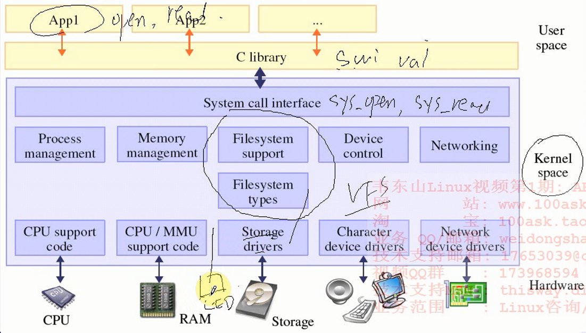
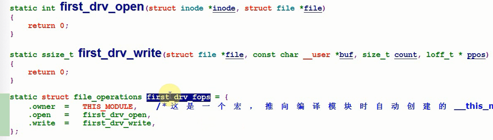
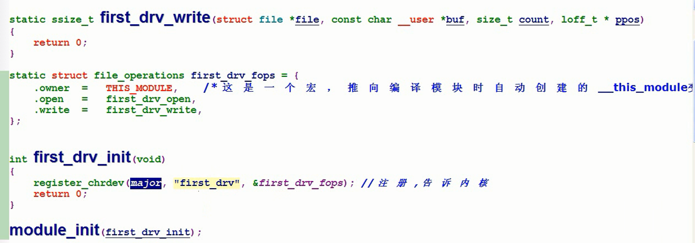
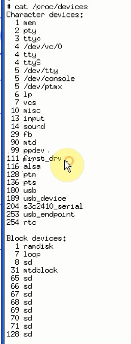
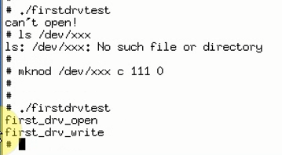
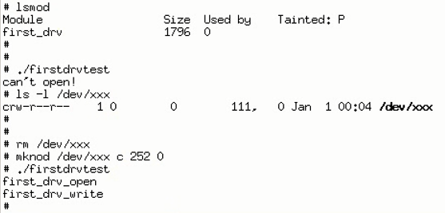

# 字符设备驱动程序之中断方式的按键驱动编写代码

本节课程讲了设备驱动模块的编写步骤+设备驱动框架(驱动框架如何衔接应用和驱动)+

## 驱动程序如何衔接应用和驱动



* 如何告知内核LED驱动？内核提供了注册驱动的方法，按照规则提供回调函数即可

首先定义一个满满函数指针结构体




在驱动中定义的结构注册到内核(主设备号，名字，fops)


* 注册设备本质就是在内核中针对字符设备准备的元数据中添加该字符设备的信息。视频中讲的数组，如果长度固定怎么办？没事，用的都是字符设备，主设备号一致

内核模块入口出口。这是内核模块LKM提供的功能，你遵循它的规范就能正常加载、卸载内核模块

* module_init和module_exit是一个宏，具体干了啥呢？内核模块加载过程中经过用户内存然后到内核内存，这期间Linux为内核模块准备了存放元数据的空间，初始化了一些数据，但是始终没有运行起内核初始化函数。加载到内存的时候，内核模块就是块内存，那么如何提取内存中的有用信息作为元数据？哪些信息作为元数据？这肯定要事先约定好
* 内核模块加载到内核空间之前已经在用户空间做了一些处理，内核模块仅仅编译，但是没有链接，会在用户态进行链接，解决符号依赖，这其中就在元数据里面设置了模块初始化和退出。那么加载到内核的时候，根据内核的规则，调用相应的函数初始化，这个时候系统应该是处于 root权限，加载内核进程insmod用户态上下文下的内核态。




这里modules_exit为嘛多了s，明显错了

## 主设备号和次设备号


* 每个设备都属于某一类，那么主设备号决定了这一类设备使用特定的驱动(但其实内核已经定义了某些大类，比如字符设备、块设备等)。
* 次设备号决定了该设备属于某一类设备的具体设备。有主设备号和次设备号唯一决定某个设备。
* 设备类型(注册驱动的时候指定)+主设备号(指定驱动)+次设备号
  - 一般的，主设备号标识出与设备关联的设备驱动。
  - 内核由次设备号确定当前所指向的是哪个设备。

在内核中，**dev_t**类型( 在 <linux/types.h> 头文件有定义 ) 用来表示设备号，包括主设备号和次设备号两部分。

对于 2.6.x 内核，dev_t 是个 32 位量，其中 12 位用来表示主设备号，20 位用来表示次设备号。

在 linux/types.h 头文件里定义有
```
typedef __kernel_dev_t          dev_t;
typedef __u32 __kernel_dev_t;
```

## 应用层到驱动层的过程分析


应用程序通过open打开某个LED设备，根据设备主设备号和次设备号在chrdev元数据找到对应主设备号

* 驱动中实现了读写等设备操作函数以及fops，然后在驱动入口注册设备
* 如果是在/dev/下有一项设备，那么基本都是通过VFS调用，也可以不这么着


## 内核模块Makefile


```
make -C 内核源码顶层Makefile目录 M=所要编译内核模块的路径 modules 告知编译成内核模块(本质就是编译但是没有链接的文件)
```

## 内核模块植入






## 为嘛需要先mknod？



手动建立设备，每次mknod多麻烦？肯定可以自动创建，怎么创建？肯定可以在代码中设定

* udev、mdev(根据系统信息创建设备节点)

## 主设备号怎么确定？


* 通过/proc/devices选一个空缺的就可以了，或者设定为0，让系统自动分配。
* 驱动可以自动分配主设备号也可以手动指定


## END
