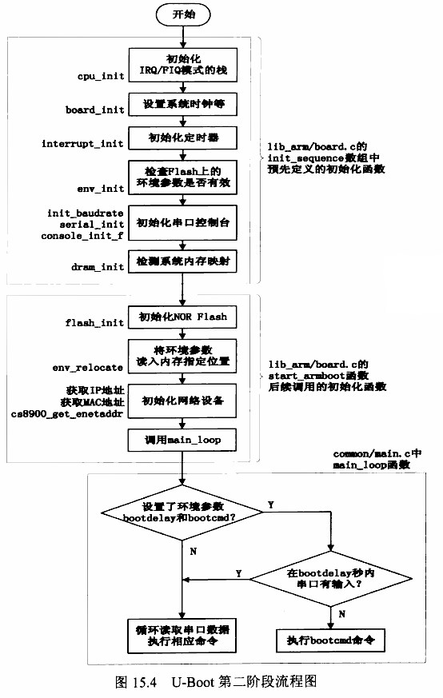
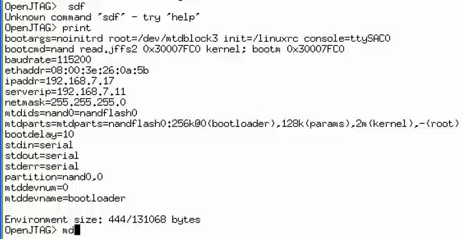

# u-boot分析之源码第2阶段

## 第二阶段初始化步骤

* 第二阶段从lib_arm/board.c中的start_armboot函数开始

## u-boot命令实现

* 串口中的输入要么无法识别，要么执行特定的命令。
* 串口中的输入字符串，对应动作肯定是对应于某个函数。典型的函数名和函数体的关系
* u-boot分装了这层关系，完成函数名对应命令名，命令执行对应函数体。还涉及到参数传递。

## END
