<!-- TOC depthFrom:1 depthTo:6 withLinks:1 updateOnSave:1 orderedList:0 -->

- [u-boot分析之编译体验](#u-boot分析之编译体验)
	- [u-boot打补丁](#u-boot打补丁)
	- [u-boot编译](#u-boot编译)
	- [烧写u-boot编译](#烧写u-boot编译)
	- [u-boot存在的意义？](#u-boot存在的意义)
	- [u-boot-1.1.6目录结构](#u-boot-116目录结构)

<!-- /TOC -->
# u-boot分析之编译体验


bootloader = BIOS，bootloader最终目的是启动内核

## u-boot打补丁


材料如上

```
-rw-r--r--  1 root      root      637K 8月  23 00:58 u-boot-1.1.6_jz2440.patch
-rw-r--r--  1 root      root      6.3M 8月  23 00:58 u-boot-1.1.6.tar.bz2
```

解压u-boot-1.1.6.tar.bz2，打补丁

```
patch -p1 < u-boot-1.1.6_jz2440.patch
```

参数p1指的是去掉目标目录最上级。
如果当前目录是在解压后的u-boot-1.1.6目录下，需要根据补丁文件中给出的路径配置参数

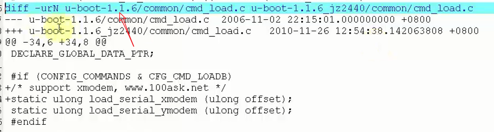

例如当前目录是在u-boot-1.1.6目录平级的目录，但是当前在u-boot-1.1.6目录下，那么就要去掉补丁中u-boot-1.1.6开头路径，这就是参数p的作用

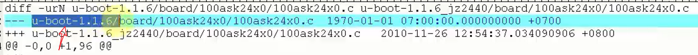

## u-boot编译

```
make 100askjz2x0_config
make
```

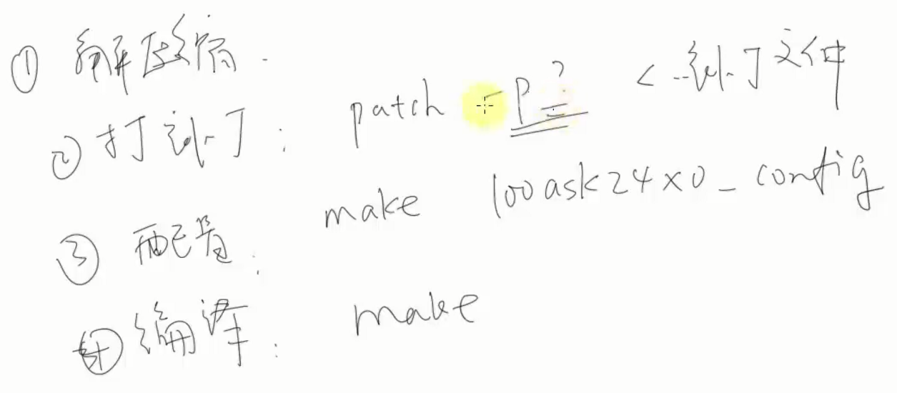

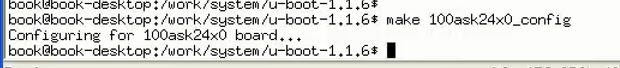

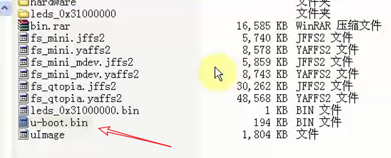

## 烧写u-boot编译

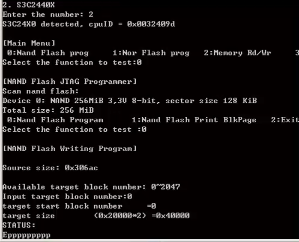

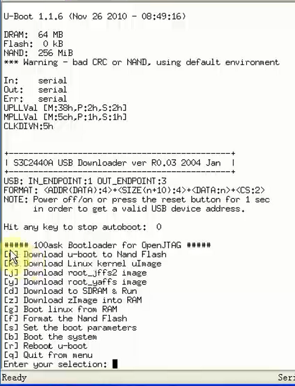

获取u-boot提供的命令

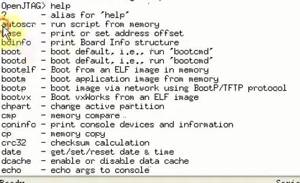

获取命令帮助

```
? 命令
```

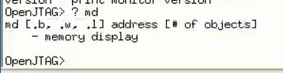

获取u-boot环境变量

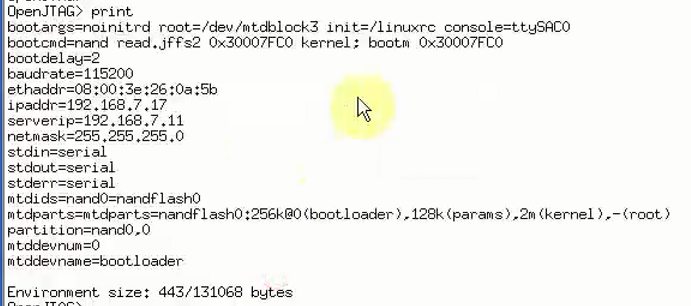

设定环境变量必须通过save保存才能生效

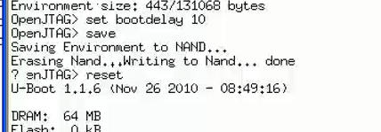

菜单命令是编程提供，输入menu即可显示

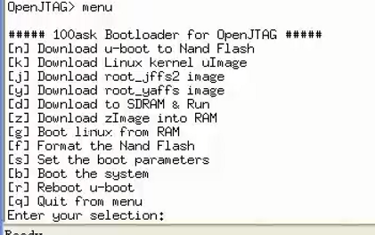

可以usb下载线，快速上传文件到开发板。相比eop快多了

## u-boot存在的意义？

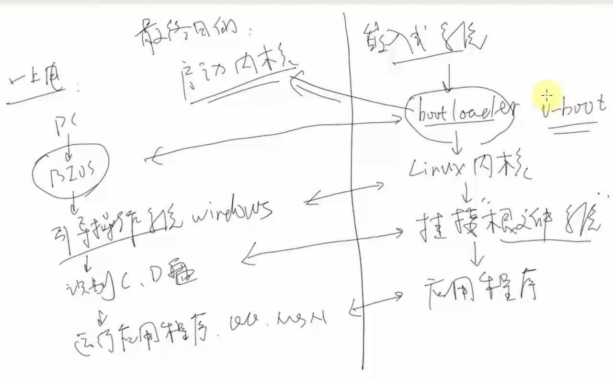

这里其实可以看的出来韦东山老师对PC机启动过程不甚了解，
PC机的bios+bootloader才等价于嵌入式的bootloader。

嵌入式系统从Flash读出内核放到SDRAM中

uboot可以理解为一个单片机程序，只是功能比较复杂

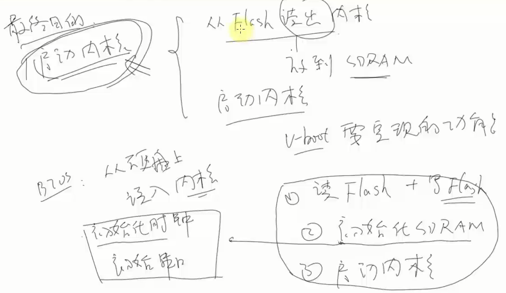

为了开发方便，一般uboot支持从网络启动内核，无非就是网络加载内核到SDRAM，也可从USB加载内核等

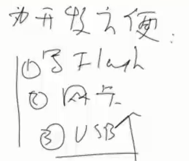

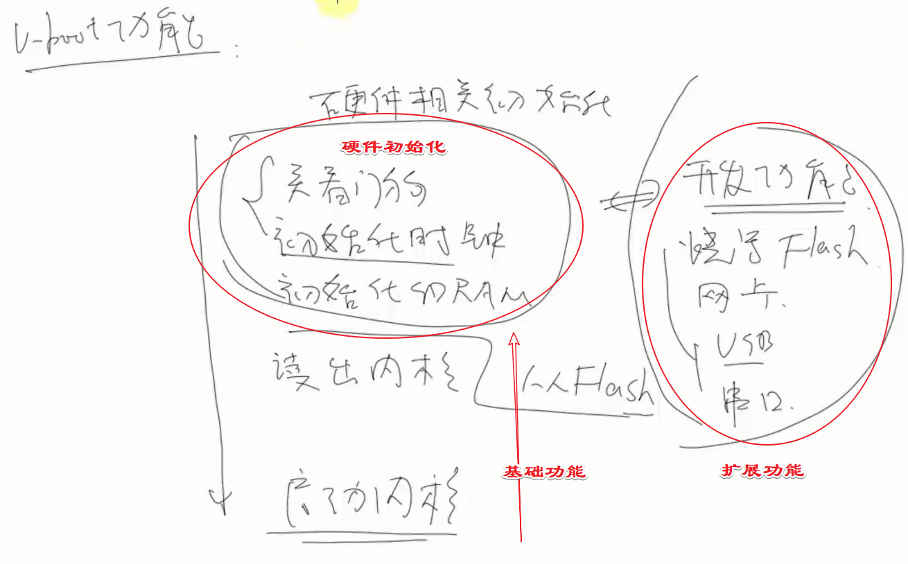


## u-boot-1.1.6目录结构


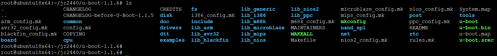


* board:单板相关
* common：通用
* CPU：处理器先关
* net：网卡相关
* drivers：驱动相关，网卡，USB等

如何分析结构？**分析Makefile**


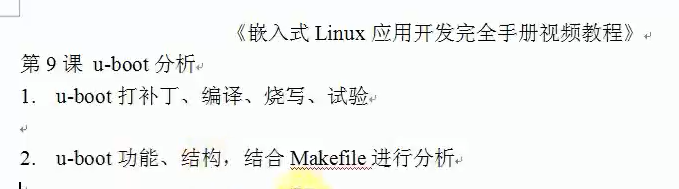
