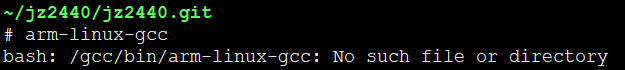
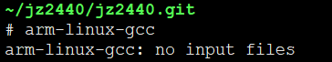

# Ubuntu 18.04


## 64位 Ubuntu 安装32位运行环境



配置gcc编译环境时，出现该错误，是因为缺少32位运行环境导致。

解决办法：

```
sudo apt-get install lib32ncurses5 lib32z1
```

```
# apt-get install lib32ncurses5 lib32z1
Reading package lists... Done
Building dependency tree       
Reading state information... Done
The following additional packages will be installed:
  lib32tinfo5 libc6-i386
The following NEW packages will be installed:
  lib32ncurses5 lib32tinfo5 lib32z1 libc6-i386
0 upgraded, 4 newly installed, 0 to remove and 6 not upgraded.
Need to get 2887 kB of archives.
After this operation, 13.4 MB of additional disk space will be used.
Do you want to continue? [Y/n] y
Get:1 http://mirrors.tencent.com/ubuntu bionic-updates/main amd64 libc6-i386 amd64 2.27-3ubuntu1.4 [2650 kB]
Get:2 http://mirrors.tencent.com/ubuntu bionic-updates/main amd64 lib32tinfo5 amd64 6.1-1ubuntu1.18.04 [79.1 kB]
Get:3 http://mirrors.tencent.com/ubuntu bionic-updates/main amd64 lib32ncurses5 amd64 6.1-1ubuntu1.18.04 [100 kB]
Get:4 http://mirrors.tencent.com/ubuntu bionic/main amd64 lib32z1 amd64 1:1.2.11.dfsg-0ubuntu2 [58.3 kB]
Fetched 2887 kB in 0s (8964 kB/s)
debconf: delaying package configuration, since apt-utils is not installed
Selecting previously unselected package libc6-i386.
(Reading database ... 70327 files and directories currently installed.)
Preparing to unpack .../libc6-i386_2.27-3ubuntu1.4_amd64.deb ...
Unpacking libc6-i386 (2.27-3ubuntu1.4) ...
Selecting previously unselected package lib32tinfo5.
Preparing to unpack .../lib32tinfo5_6.1-1ubuntu1.18.04_amd64.deb ...
Unpacking lib32tinfo5 (6.1-1ubuntu1.18.04) ...
Selecting previously unselected package lib32ncurses5.
Preparing to unpack .../lib32ncurses5_6.1-1ubuntu1.18.04_amd64.deb ...
Unpacking lib32ncurses5 (6.1-1ubuntu1.18.04) ...
Selecting previously unselected package lib32z1.
Preparing to unpack .../lib32z1_1%3a1.2.11.dfsg-0ubuntu2_amd64.deb ...
Unpacking lib32z1 (1:1.2.11.dfsg-0ubuntu2) ...
Setting up libc6-i386 (2.27-3ubuntu1.4) ...
Setting up lib32z1 (1:1.2.11.dfsg-0ubuntu2) ...
Setting up lib32tinfo5 (6.1-1ubuntu1.18.04) ...
Setting up lib32ncurses5 (6.1-1ubuntu1.18.04) ...
Processing triggers for libc-bin (2.27-3ubuntu1.4) ...
```

验证：


