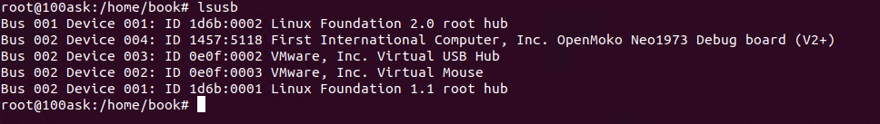

# Win 10 64位

## EOP驱动安装

用管理员打开命令行,输入下面两条命令,即可永久关闭驱动签名,但安全性自行考虑

```
bcdedit -set loadoptions DDISABLE_INTEGRITY_CHECKS
bcdedit /set TESTSIGNING ON
```


安装重启，配置关闭

```
bcdedit /set TESTSIGNING OFF
```


## Linux EOP


